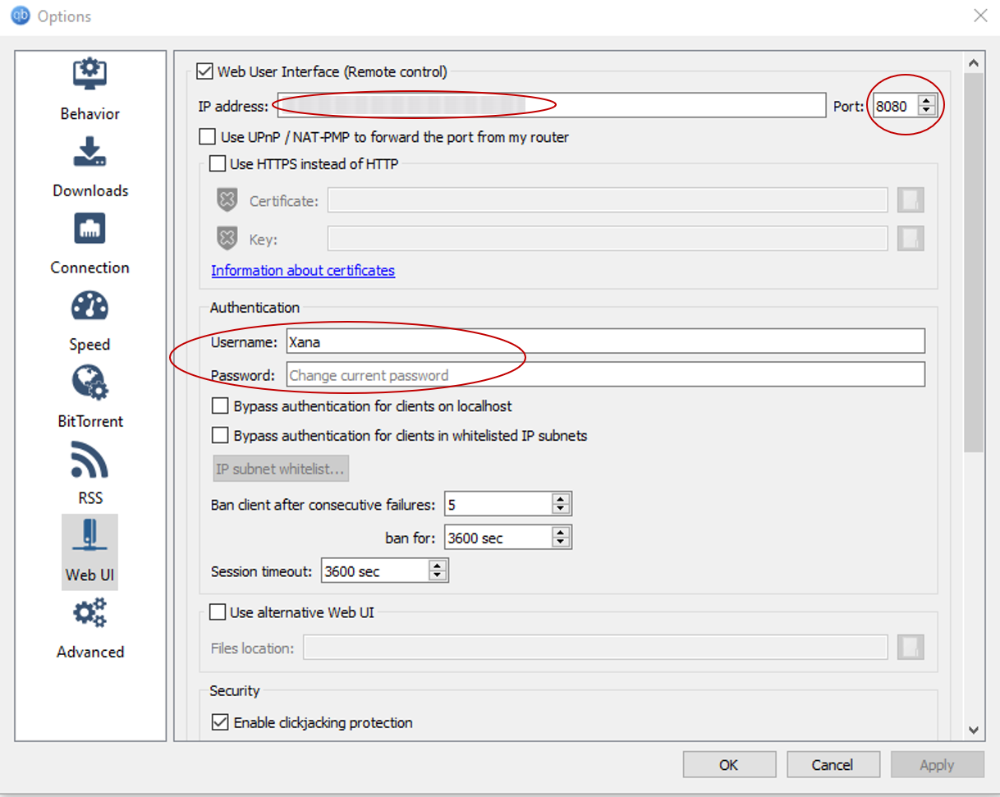

</br></br>
# Aniloader
Update your Anime-Library with one command!

<!-- TABLE OF CONTENTS -->
<details open="open">
  <summary>Table of Contents</summary>
  <ol>
    <li>
      <a href="#about-aniloader">About Aniloader</a>
      <ul>
        <li><a href="#built-with">Built With</a></li>
      </ul>
    </li>
    <li>
      <a href="#getting-started">Getting Started</a>
      <ul>
        <li><a href="#prerequisites">Prerequisites</a></li>
        <li><a href="#installation">Installation</a></li>
      </ul>
    </li>
    <li>
      <a href="#usage">Usage</a>
      <ul>
        <li><a href="#simple-download">Simple Download</a></li>
        <li><a href="#update-new-episodes">Update New Episodes</a></li>
        <li><a href="#update-seasonal">Update Seasonal</a></li>
        <li><a href="#standardize">Standardize</a></li>
      </ul>
    </li>
    <li><a href="#roadmap">Roadmap</a></li>
    <li><a href="#contributing">Contributing</a></li>
    <li><a href="#contact">Contact</a></li>
  </ol>
</details>


<!-- ABOUT THE PROJECT -->
## About Aniloader

As a frequent Anime-watcher and Series-Collector, who wants to stay up to date with the newest releases in an hourly fashion,
I had to find a solution to the constant *"Downloading all Episodes released that day in the evening".* So I automated it. 
I hope that this Programm can lighten your day, even if just by a bit.

Not affiliated to source i.e. **[subsplease.org](https://subsplease.org)** in any way <br />
Support the official site **[subsplease.org](https://subsplease.org)**

Here's why:
* Your time to browse the **NEW** Anime of the day and downloading every single Episode manually can be used for much more important activities. Like watching more Anime!
* You shouldn't have to organize your entire library manually just so Daddy-Plex is happy. It's a hassle. Let Aniloader take care of it for you.
* You should just be able to enjoy the latest Anime right when it comes out. Let Aniloader do the delivery :mailbox_with_mail:

Of course, this is only one of the possible functions. So you can expect me to be adding more features soon. You may also suggest changes by forking this repo and creating a pull request or opening an issue.

### Built With

* [Selenium](https://www.selenium.dev/)
* [qBittorrent](https://www.qbittorrent.org/)
* [SubsPlease](https://subsplease.org/)
* [Plex](https://www.plex.tv/)


<!-- GETTING STARTED -->
## Getting Started


### Prerequisites

* Plex</br>
Though not a necessity, I very much recommend the media-Player due to its versatility.
[Official Site](https://www.plex.tv/)

* qBittorrent</br>
This Application uses the **qBittorrent Web UI** to manage the Magnet-Links found on SubsPlease. After installing it from the [official site](https://www.qbittorrent.org/), 
make sure that the *options->Web UI* match this Picture:</br></br>
</br></br>
**IP address:** Type your IPv4-address. You can find it by typing *ipconfig* in your console</br>
**Port:** Make sure this number matches with the *torrent_port* you defined in Aniloaders `config.py`</br>
**Authentication:** Define a username and password</br></br>

* **How to disable Login:**</br>
      - Turn *Bypass authentication for clients in whitelisted IP subnets* on</br>
      - Click on *IP subnet whitelist...*</br>
      - Enter your IP address and click on *Add subnet*, then click on *OK*</br>
      - Finally click on *Apply*</br>


### Installation

1. Clone the repo
   ```sh
   git clone https://github.com/Xanahol/Aniloader.git
   ```
3. Install requirements
   ```sh
   pip install -r .\requirements.txt
   ```
4. Enter your settings in `config.py`
   ```python
   #Example
   ip_4 = "192.168.4.162" 
   torrent_port = "8080"
   directories = ['C:\Example\Plex\Anime', 'D:\Example\Path\To\Plex\Anime']
   ```


<!-- USAGE EXAMPLES -->
## Usage

Here is how you can run the different modes and what they do:

### Simple Download
 #### Download a specific Anime / Update it in your library to the newest version!</br></br>
  To run, type:</br>

  ```console
  python.exe .\main.py -m getAnime  
  ```
  </br>
  Aniloader connects to SubsPlease and the qBittorrent Web-UI.</br>

  ```console
    Feb-28-2021 18:55:38 - INFO - Connecting to Subsplease
    Feb-28-2021 18:55:38 - INFO - Connecting to the qBittorrent
    Feb-28-2021 18:55:38 - INFO - Your IP is: 192.168.1.135
  ```
  </br>

  Aniloader starts up by asking for your qBittorrent-credentials. Type them into the console and hit **Enter**.</br>

  ```console
    Please enter your credentials for qBittorrent:
    Username: Xana
    Password (Invisible): MyVerySafePassword123
    Feb-28-2021 18:55:38 - INFO - Login successful!
  ```
  </br>

  It then proceeds by asking you for the Anime name. Type the name of the Anime you would like to update/download. It works the most reliable when the title is directly taken from **[subsplease.org](https://subsplease.org)**:</br>

  ```console
    Which anime would you like to download?
    Akudama Drive
    Feb-28-2021 18:55:38 - INFO - This anime is batched
    Feb-28-2021 18:55:38 - INFO - Collecting batch-link for Akudama Drive | Season 1
    Feb-28-2021 18:55:38 - INFO - Collected batch-link
  ```
  </br>

  After the Links have been collected, they are submitted to qBittorrent.</br>
  If the anime/season folder doesn't exist, Aniloader adds it (first defined dir in `config.py`). If one does, it uses the one already defined.</br>

  ```console
    Feb-28-2021 18:55:38 - INFO - Starting Download-Process...

    Feb-28-2021 18:55:38 - INFO - The anime Akudama Drive has 12 episodes so far
    Feb-28-2021 18:55:38 - INFO - Downloading them to C:\Example\Plex\Anime\Akudama Drive\Season 01
    Feb-28-2021 18:55:38 - INFO - 3 of which are not on the server yet
    Feb-28-2021 18:55:38 - INFO - Deleting out of date files
    Feb-28-2021 18:55:38 - INFO - Inserting Links to download
    Feb-28-2021 18:55:38 - INFO - Inserting Download Path
    Feb-28-2021 18:55:38 - INFO - Submitting Links
    Feb-28-2021 18:55:38 - INFO - Process finished for Akudama Drive
  ```
  </br>

  At this point, you can monitor what is being put in your download-queue and you can delete whatever you don't need.</br></br>

### Update New Episodes
 #### Update your library with the freshest Anime of the day!</br></br>
  To run, type:</br>

  ```console
  python.exe .\main.py -m updateNewEpisodes  
  ```
  </br>
  Aniloader connects to SubsPlease and the qBittorrent Web-UI.</br>

  ```console
    Feb-28-2021 18:55:38 - INFO - Connecting to Subsplease
    Feb-28-2021 18:55:38 - INFO - Connecting to the qBittorrent
    Feb-28-2021 18:55:38 - INFO - Your IP is: 192.168.1.135
  ```
  </br>

  Aniloader starts up by asking for your qBittorrent-credentials. Type them into the console and hit **Enter**.</br>

  ```console
    Please enter your credentials for qBittorrent:
    Username: Xana
    Password (Invisible): MyVerySafePassword123
    Feb-28-2021 18:55:38 - INFO - Login successful!
  ```
  </br>

  It then proceeds collecting the links of every Anime with the NEW-Tag:</br>

  ```console
    Feb-28-2021 18:55:38 - INFO - Found 14 Anime with the tag "New!"
    Feb-28-2021 18:55:38 - INFO - Collecting links for Non Non Biyori Nonstop | Season 1
    Feb-28-2021 18:55:38 - INFO - Collected 8 links
    Feb-28-2021 18:55:38 - INFO - Collecting links for Idoly Pride | Season 1
    Feb-28-2021 18:55:38 - INFO - Collected 8 links 
    ...
  ```
  </br>

  After the Links have been collected, they are submitted to qBittorrent.</br>
  If the anime/season folder doesn't exist, Aniloader adds it (first defined dir in `config.py`). If one does, it uses the one already defined.</br>

  ```console
    Feb-28-2021 18:55:38 - INFO - Starting Download-Process...

    Feb-28-2021 18:55:38 - INFO - The anime Non Non Biyori Nonstop has 8 episodes so far
    Feb-28-2021 18:55:38 - INFO - Downloading them to C:\Example\Plex\Anime\Non Non Biyori Nonstop\Season 01
    Feb-28-2021 18:55:38 - INFO - 1 of which are not on the server yet
    Feb-28-2021 18:55:38 - INFO - Inserting Links to download
    Feb-28-2021 18:55:38 - INFO - Inserting Download Path
    Feb-28-2021 18:55:38 - INFO - Submitting Links
    Feb-28-2021 18:55:38 - INFO - Process finished for Non Non Biyori Nonstop

    Feb-28-2021 18:55:38 - INFO - The anime Idoly Pride has 8 episodes so far
    Feb-28-2021 18:55:38 - INFO - Downloading them to C:\Example\Plex\Anime\Season 01
    Feb-28-2021 18:55:38 - INFO - 1 of which are not on the server yet
    Feb-28-2021 18:55:38 - INFO - Inserting Links to download
    Feb-28-2021 18:55:38 - INFO - Inserting Download Path
    Feb-28-2021 18:55:38 - INFO - Submitting Links
    Feb-28-2021 18:55:38 - INFO - Process finished for Idoly Pride
    ...
  ```
  </br>

  At this point, you can monitor what is being put in your download-queue and you can delete whatever you don't need.</br></br>


### Update Seasonal
 #### Download all the Anime of the Season!</br></br>
  To run, type:</br>

  ```console
  python.exe .\main.py -m getAllSeasonal  
  ```
  </br>
  
  From this point on it is pretty much exactly as *Update New Episodes*

 ### Standardize
 #### Standardize your library for Plex!</br></br>
  To run, type:</br>

  ```console
  python.exe .\main.py -m standard
  ```

   Aniloader will go through your library and standardize them for Plex:</br>

  ```console
    Feb-28-2021 19:30:46 - INFO - Renaming Hataraku Saibou Black Season 1
    Feb-28-2021 19:30:46 - INFO - Renaming successful
    Feb-28-2021 19:30:46 - INFO - Renaming Healin Good Precure Season 1
    Feb-28-2021 19:30:46 - INFO - Renaming successful
    Feb-28-2021 19:30:46 - INFO - Renaming Heya Camp Season 1
    Feb-28-2021 19:30:46 - INFO - Renaming successful
    ...
  ```
  </br>

<!-- ROADMAP -->
## Roadmap

See the [open issues](https://github.com/Xanahol/Aniloader/issues) for a list of proposed features (and known issues).


<!-- CONTRIBUTING -->
## Contributing

Contributions are what makes the open-source community such an amazing place to learn, inspire, and create. Any contributions you make are **greatly appreciated**.

1. Fork the Project
2. Create your Feature Branch (`git checkout -b feature/AmazingFeature`)
3. Commit your Changes (`git commit -m 'Add some AmazingFeature'`)
4. Push to the Branch (`git push origin feature/AmazingFeature`)
5. Open a Pull Request


<!-- CONTACT -->
## Contact

Noël B. - [@_noel_br](https://www.instagram.com/_noel_br/?hl=en)

Project Link: [https://github.com/Xanahol/Aniloader](https://github.com/Xanahol/Aniloader)

